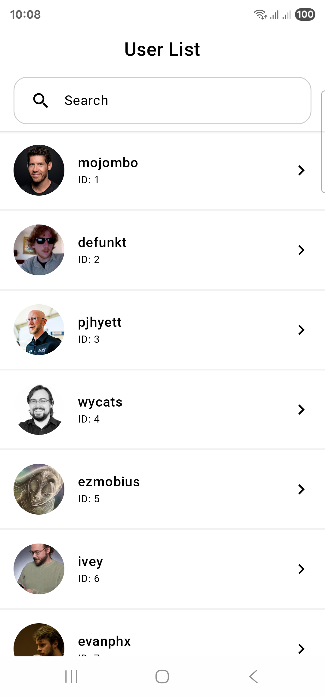
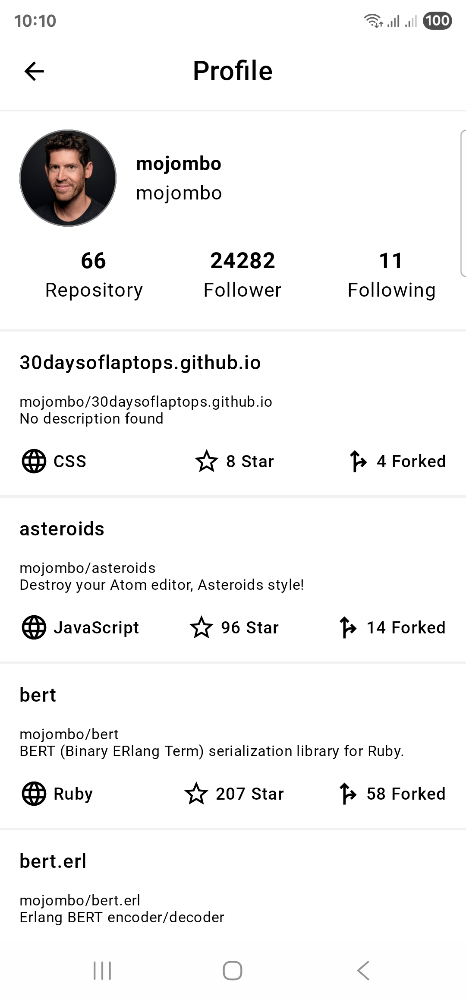

# GitHubUserApp

GitHubUserApp is a modular, modern Android application built with Kotlin, Jetpack Compose, and Clean Architecture. It allows users to search for GitHub profiles, view detailed user info, and explore public repositories—all powered by the GitHub REST API.

---

## Features

-  GitHub user search by username
-  View profile: avatar, bio, repo/follower/following stats
-  Explore public repositories with language, stars, forks
-  Clean Architecture with feature-based modularity
-  Hilt for dependency injection
-  Jetpack Compose + Material 3 for modern UI
-  Pull-to-refresh support
-  Unit and UI test coverage

---

## Screenshots

Here are some screenshots of the GitHubUserApp in action:

<p align="center">
  
  
</p>

---

## 🛠 Tech Stack
```markdown
| Layer        | Tech Used                                         |
|--------------|--------------------------------------------------|
| Language     | Kotlin                                            |
| UI           | Jetpack Compose, Material 3                      |
| Architecture | MVVM + Clean Architecture + Modularization        |
| Networking   | Retrofit, OkHttp                                  |
| Async        | Coroutines, Flow                                  |
| Dependency Injection | Hilt                                     |
| Testing      | JUnit, MockK, Turbine, Compose UI Test, HiltTest |
| Build System | Gradle (Kotlin DSL), Custom build-logic plugins  |
```

---

## 🗂️ Project Structure
```markdown
GitHubUserApp/
├── app/                         # Application entry point and main UI layer
│   ├── manifests/
│   ├── kotlin+java/             # Compose-based UI screens
│   ├── res/
│   └── build.gradle.kts
│
├── build-logic/                 # Custom Gradle plugins
│   └── convention/
│       ├── main/
│       ├── test/
│       └── build.gradle.kts
│
├── core/                        # Shared code across features
│   ├── data/                    # Shared data utilities or sources
│   ├── designsystem/            # Typography, color scheme, components
│   ├── di/                      # Hilt modules and providers
│   ├── domain/                  # Shared use cases and interfaces
│   └── ui/                      # Reusable UI components
│
├── features/                    # Modular feature-based implementation
│   ├── profile/                 # User profile screen (view, viewmodel, usecase)
│   └── userslist/               # User list screen (search, list, viewmodel)
│
├── model/                       # Data models
│   ├── apiresponse/             # DTOs from GitHub API
│   └── entity/                  # Domain-level data representations
│
├── gradle/
│   └── wrapper/                 # Gradle wrapper configuration
│
├── settings.gradle.kts
├── build.gradle.kts
└── README.md
```
